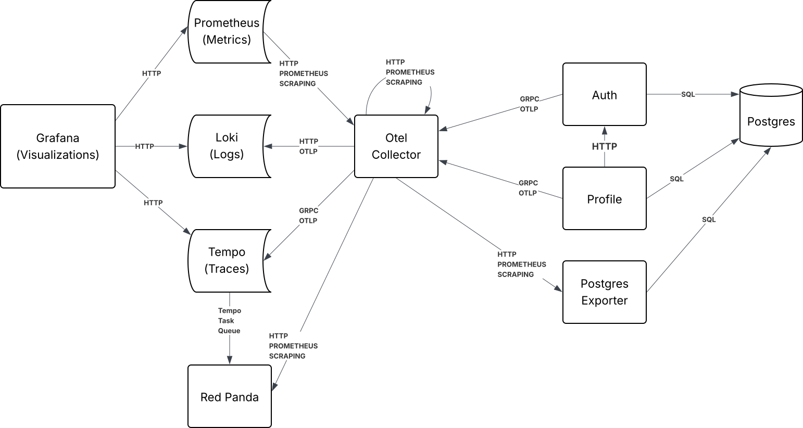

# Otel Workshop

## Requirements

- A container runtime
  - [Docker Desktop](https://docs.docker.com/desktop/)
  - [Podman Desktop](https://podman-desktop.io/)
    - If you use Podman you will need to set the `CONTAINER_RUNTIME` environment
    variable to `podman`
- Make
  - Generally preinstalled on UNIX like systems
  - [Make for Windows](https://gnuwin32.sourceforge.net/packages/make.htm)
    - I don't have a Windows machine so YMMV

## Overview

This is a simple service to service flow to demonstrate the capabilities of OpenTelemetry.
We have an `Auth` service to create, validate and get users and a `Profile` service
to create, update and get profile data. This flows into our `OpenTelemetry Collector`,
which takes all our signals and forwards them to their respective storage systems.
Speaking of telemetry storage systems, we are using the _LGTM_ stack:

- `Loki` for logs
- `Grafana` for our UI
- `Tempo` for traces
- `Mimir` (We are using an equivalent called `Prometheus`) for metrics.

That sure looks good to me...

### Diagram

Below we have a diagram explaining how data flows between these services



### Auth Service

An authentication service with the following endpoints:

`POST /signUp`

```sh
curl -X POST http://localhost:8000/signup \
  -H "Content-Type: application/json" \
  -d '{"email": "user@example.com", "password": "Password123"}'
```

`POST /signIn`

```sh
curl -X POST http://localhost:8000/signin \
  -H "Content-Type: application/json" \
  -d '{"email": "user@example.com", "password": "Password123"}'
```

`GET /user`

_requires token from signin/signup_

```sh
curl http://localhost:8000/user \
  -H "Authorization: bearer $TOKEN"
```

### Profile Service

A user profile service that authenticates against the `Auth` service. It has the
following endpoints:

`GET /`

```sh
curl http://localhost:8080/ \
  -H "Authorization: bearer $TOKEN"
```

`PUT /`

**NOTE:** _this will create a profile if one does not exist._

```sh
curl -X PUT http://localhost:8080/ \
  -H "Authorization: bearer $TOKEN" \
  -H "Content-Type: application/json" \
  -d '{"username": "johndoe", "bio": "Hello world", "location": "New York, NY, 10001, 123 Main St"}'
```

### Otel Collector

Proxy that receives, processes, and exports data to Loki, Tempo, and Prometheus
backends.

Runs on the following ports:

| Transport | Use | Port |
| --------------- | --------------- | --------------- |
| gRPC | OTLP | `4317` |
| HTTP | OTLP | `4318` |
| HTTP | Health Check | `131311` |
| HTTP | Debug | `55679` |
| HTTP | Metrics | `8888` |

### Tempo

Data store for traces

Runs on <http://localhost:3200/>

- Receives OTLP data over gRPC on port `4317` (This port isn't exposed as it
would conflict with our collector)

#### Red Panda

Tempo utilizes a Kafka compatible queue for handling workloads.

### Loki

Data store for logs

Runs on <http://localhost:3100/>

- Receives OTLP data over HTTP

### Prometheus

Data store for metrics

- Runs on <http://localhost:9090>
- Scrapes data from the Collector on port `9090` (This port isn't exposed on the
collector container because it would conflict with the Prometheus container)

## Grafana

Grafana is our visualization tool. It pulls in data from our sources to let us
create graphs and dashboards.

The `Grafana` container exposes port `3000`. Just load up `http//localhost:3000`.

## Starting the Services

To bring up the services defined here you can run `make up`. This will start the
services in the current terminal. If you want to start them detached you can use
`make ARGS="-d" up`.

## Gen Traffic

Once all the services are up and running you can run our `gentraffic` script. This
is a pretty simple script that just generates dummy data for services so we can
actually visualize something. It will create a bunch of fake users, then create
profiles for them as well. Run the following:

`make trafficgen`

This will spin up a Docker container and create 100 fake users. If you want to
change the number of users you can use the `USER_COUNT` environment variable:

`make trafficgen USER_COUNT=1000` would generate 1000 fake users.

## Generating Signals

Once you have the collector running you can run
[telemetrygen](https://github.com/open-telemetry/opentelemetry-collector-contrib/tree/main/cmd/telemetrygen),
a helpful CLI tool from OpenTelemetry to generate dummy signals to test our
collector setup. You can run this inside of Docker using `make telemetrygen`.
This will default to sending 3 traces to the collector. If you want to test other
signals in other quantities you can use these make variables:

- `SIGNAL`
  - The signal to send. Needs to be one of `traces`, `logs`, or `metrics`
- `COUNT`
  - The number of signals to send

For example, we could use the following to send 5 logs: `make SIGNAL=logs COUNT=5 telemetrygen`.

## Links

Here are links to all the technologies we used:

- [Otel Collector](https://github.com/open-telemetry/opentelemetry-collector-contrib)
- [Loki](https://github.com/grafana/loki)
- [Grafana](https://github.com/grafana/grafana)
- [Tempo](https://github.com/grafana/tempo)
- [Prometheus](https://github.com/prometheus/prometheus)
- [Red Panda](https://github.com/redpanda-data/redpanda)
- [Postgres](https://www.postgresql.org/list/pgsql-hackers/)
- [Postgres Exporter](https://github.com/prometheus-community/postgres_exporter)
- [NodeJS](https://github.com/nodejs/node)
- [Go](https://github.com/golang/go)
- [Tons of Otel libraries and packages](https://opentelemetry.io/docs/languages/)
