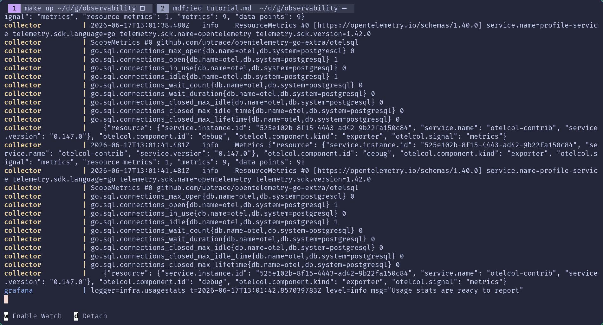

# Tutorial

Okay, let's get down to brass tacks here. You want to see some telemetry data,
and we can help you do that. Let's go over what we will be doing:

- Starting our base collector that just prints incoming OTel signals to stdout.
- Getting the logs for our services into our log storage, [Loki](./loki/).
- Setting up tracing using [Tempo](./tempo/).
  - Also hooking it up to our logs for correlation
- Ingesting metrics through both [OTLP](https://opentelemetry.io/docs/specs/otel/protocol/)
and [Prometheus](./prometheus/) scraping.
- Using that data to build visualizations in [Grafana](./grafana/)

## Starting the Collector

Once you have met all the [requirements](/README.md#requirements), you can run
`make up` to bring all the services up. The base collector takes in telemetry
signals and prints them out to the console. There will be a _lot_ of noise
from the other services, but you should see something similar to this:



Great! Now we are collecting information from our running services. Next we will
work on _storing_ that data so we can utilize it in things like visualizations.

## Storing Data

We will be utilizing the _LGTM_ stack for our telemetry data storage.

- **L**oki
- **G**rafana
- **T**empo
- **M**imir
  - We are technically using Prometheus since it is easier to setup

### Tracing with Tempo

The easiest signal to setup are `traces`. This is because both the `receiver`
_and_ the `exporter` use OTLP. Since OTLP is already set up as a `receiver`,
which means we just need to add the `exporter`.

Go into the [collector config](./collector/config.yaml) and add a new entry in
the `exporters` section called `otlp_grpc`. These exporter keys are the specific
implementation that the collector will use to send these signals after receiving
and processing them. In this case, that is OTLP over GRPC.

Now your exporter section should look like this:

```
exporters:
+ otlp_grpc:
  ...
```

Next we need to tell the collector _where_ to send this data. Luckily Docker
networking lets us just use the container name as a hostname and we are just using
the default port for Tempo runs on port 4317. Add a `endpoint` key to the
`otlp_grpc` object with a value of `tempo:4317`. Also, since we are not running
TLS on this instance (Or running it through a reverse proxy that terminates TLS),
we need to add a `tls` key, with an `insecure` key set to `false`.

All together it should look like this:

```
exporters:
  otlp_grpc:
+   endpoint: tempo:4317
+   tls:
+     insecure: true
  ...
```

Lastly we just need to tell our pipeline to use this exporter for our traces.
Add a new entry to the `traces` service pipeline `exporters` list like so:

```
services:
  ...
  pipelines:
    ...
    traces:
      receivers:
        - otlp
      exporters:
        - debug
+       - otlp_grpc
```

Just restart your collector with `make restart-collector`. Now you should have
traces flowing from the services, to the collector, and out to our Tempo data store.

If you then run the `make gentelemetry` script it will send some dummy traces to
the collector. To validate this you can check inside the
[Grafana traces drilldown](http://localhost:3000/a/grafana-exploretraces-app/explore).

### Logging with Loki

Next we are going to get _logs_ working through our system. This will pretty similar to _traces_.

Go into the [collector config](./collector/config.yaml) and add a new entry in
the `exporters` section called `otlp_http`. Same as for traces, this is to enable
the OTLP exporter, but over HTTP instead of GRPC. For this we only need the
`endpoint` key set to `http://loki:3100/otlp`. This is the endpoint that Loki
accepts logs via OTLP.

Now your exporter section should look like this:

```
exporters:
+ otlp_http:
+   endpoint: http://loki:3100/otlp
  ...
```

Add a new entry to the `logs` service pipeline `exporters` list like so:

```
services:
  ...
  pipelines:
    ...
    logs:
      receivers:
        - otlp
      exporters:
        - debug
+       - otlp_http
```

Just restart your collector with `make restart-collector`. Now you should have
logs flowing from the services, to the collector, and out to our Loki data store.

If you then run the `make SIGNAL=logs gentelemetry` script it will send some
dummy logs to the collector. To validate this you can check inside the
[Grafana logs drilldown](http://localhost:3000/a/grafana-lokiexplore-app/explore).

### The Big Fish, Metrics with Prometheus

This one is going to require a pretty significant amount of changes. We accept
metrics via OTLP from our collector and our auth and profile services. However,
we also want to collect metrics about our postgres instance and our redpanda instance.
To do this we will be using the [Prometheus Receiver](https://github.com/open-telemetry/opentelemetry-collector-contrib/blob/main/receiver/prometheusreceiver/README.md).

#### Receiving Metrics

To start, add the `prometheus` key to your receivers object with a `config`
key with a `scrape_configs` key inside that. Overall it should look like:

```
receivers:
  ...
+ prometheus:
+   config:
+   scrape_configs:
```

Now we need to tell this receiver where to scrape metrics from. The scrape config needs the following information:

- `job_name`: a unique name for each scraping jobs
- `scrape_interval`: how often this job should run
- `scrape_timeout`: how long the scrape should run before quitting.
  - This needs to be less than the `scrape_interval`
- `static_configs`: a list of static config information
  - `targets`: a list of metric endpoints
- `metrics_path`: an optional path if the service uses a nonstandard path for metrics

To instrument our `postgres-exporter` we will add the following scrape config:

```
receivers:
  ...
  prometheus:
    config:
      scrape_configs:
+       - job_name: "postgres"
+         scrape_interval: 20s
+         scrape_timeout: 10s
+         static_configs:
+           - targets:
+               - "postgres-exporter:9187"
```

This sets up a job called `postgres` that runs every `20s` and times out after
`10s`. It checks for metrics at the `postgres-exporter` hostname on port `9187`
using the standard `/metrics` endpoint.

Next we can instrument our redpanda instance:

```
receivers:
  ...
  prometheus:
    config:
      scrape_configs:
        ...
+       - job_name: "redpanda"
+         scrape_interval: 20s
+         scrape_timeout: 10s
+         static_configs:
+           - targets:
+               - "redpanda:9644"
+         metrics_path: /public_metrics
```

This sets up a job called `redpanda` that runs every `20s` and times out after
`10s`. It checks for metrics at the `redpanda` hostname on port `9644`
using the metrics path of `/public_metrics`.

Now we need to add this new receiver to our `metrics` service pipeline
`receivers` list:

```
services:
  ...
  pipelines:
    ...
    metrics:
      receivers:
        - otlp
+       - prometheus
      exporters:
        - debug
```

#### Exporting Metrics

Time to get these metrics to our _Prometheus_ backend. Let's setup an exporter
Prometheus can scrape and ingest metrics from. We will be using the `prometheus`
exporter. Start by adding it to our `exporters` object:

```
exporters:
+ prometheus:
  ...
```

There are a couple things we need to provide here:

- `endpoint`: where the exporter will expose the metrics endpoint to be scraped
- `translation_strategy`: tells the exporter how to translate OTLP metric and
attribute names into the Prometheus format
- `resource_to_telemetry_conversion.enabled`: converts all resource attributes to
metric labels.

We are going to set our _endpoint_ to `0.0.0.0:9090`. This just tells the exporter
to expose port 9090 on the current host. We set _translation_strategy_ to
`UnderscoreEscapingWithoutSuffixes` which has the exporter escape the metric names
the same way Prometheus would, and appends unit and type suffixes. Lastly we enable
_resource_to_telemetry_conversion_ to convert our resource attributes to metric
labels for the best compatibility.

```
exporters:
  prometheus:
+   endpoint: "0.0.0.0:9090"
+   translation_strategy: "UnderscoreEscapingWithoutSuffixes"
+   resource_to_telemetry_conversion:
+     enabled: true
...
```

Now we just need to add it to our `metrics` service pipeline `exporters` list:

```
services:
  ...
  pipelines:
    ...
    metrics:
      receivers:
        - otlp
        - prometheus
      exporters:
+       - prometheus
        - debug
```

Just restart your collector with `make restart-collector`. Now you should have
metrics flowing from our sources, to the collector, and out to our Prometheus
data store.

If you wait a bit you should start getting metrics from our services,
but if you want to send some dummy metrics you can do so with
`make SIGNAL=metrics gentelemetry`. To validate this you can check inside the
[Grafana metrics drilldown](http://localhost:3000/a/grafana-metricsdrilldown-app/drilldown).
